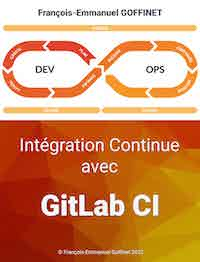

# Intégration continue avec GitLab CI

Auteur : {{ book.author }}

Date de fabrication : {{ gitbook.time }}, v1.0

<!--
Téléchargements des supports

* [PDF](https://gitlab-ci.goffinet.org/pdf.html)
* [MOBI](https://gitlab-ci.goffinet.org/mobi.html)
* [EPUB](https://gitlab-ci.goffinet.org/epub.html)


-->

## Téléchargements des supports

* [PDF](https://gitlab-ci.goffinet.org/gitlab-ci.goffinet.org.pdf)
* [MOBI](https://gitlab-ci.goffinet.org/gitlab-ci.goffinet.org.mobi)
* [EPUB](https://gitlab-ci.goffinet.org/gitlab-ci.goffinet.org.epub)
* [PPT](https://gitlab-ci.goffinet.org/gitlab-ci.goffinet.org-ppt.pdf)


<!-- toc -->

## 1. Introduction au projet GitLab

[GitLab](https://gitlab.com/) est un outil de gestion du cycle de vie de DevOps basé Web qui fournit un gestionnaire de référentiel Git fournissant des fonctionnalités wiki, de suivi des problèmes et de pipeline CI/CD. Il est développé sous licence open-source par GitLab Inc.


Le logiciel se décline en quatre produits :

* GitLab CE (Community Edition) - auto-hébergé et gratuit, support communautaire.
* GitLab EE (Enterprise Edition) - auto-hébergé et payant, fonctionnalités supplémentaires.
* GitLab.com - SaaS et gratuit.
* GitLab.io - Instance privée gérée par GitLab Inc.

Les outils comparables sont par exemple [GitHub](https://github.com/) ou [Bitbucket](https://bitbucket.org/).

## 2. Introduction à DevOps avec GitLab CI

La documentation de GitLab CI sur trouve à l'adresse [https://docs.gitlab.com/ee/ci/README.html](https://docs.gitlab.com/ee/ci/README.html).


Un cycle de vie DevOps se compose de différentes étapes en boucle : "Plan", "Create", "Verify", "Package", "Release", "Monitor". De manière transversale "Manage" et "Secure" s'intéressent à toutes les étapes du cycle.


| DevOps Stage | Description |
| --- | --- |
| [Manage](https://docs.gitlab.com/ee/README.html#manage) | Statistiques et fonctions d'analyse. |
| [Plan](https://docs.gitlab.com/ee/README.html#plan) | Planification et gestion de projet. |
| [Create](https://docs.gitlab.com/ee/README.html#create) | Fonctions SCM (Source Code Management) |
| [Verify](https://docs.gitlab.com/ee/README.html#verify) | Tests, qualité du code et fonctions d'intégration continue. |
| [Package](https://docs.gitlab.com/ee/README.html#package) | Registre des conteneurs Docker. |
| [Release](https://docs.gitlab.com/ee/README.html#release) | Release et de livraison de l'application. |
| [Configure](https://docs.gitlab.com/ee/README.html#configure) | Outils de configuration d'applications et d'infrastructures. |
| [Monitor](https://docs.gitlab.com/ee/README.html#monitor) | Fonctions de surveillance et de métrique des applications. |
| [Secure](https://docs.gitlab.com/ee/README.html#secure) | Fonctionnalités de sécurité. |

### Informations de départ

[Get started with GitLab](https://docs.gitlab.com/ce/intro/)

### Organize

Create projects and groups.

- [Create a new project](https://docs.gitlab.com/ce/gitlab-basics/create-project.md)
- [Create a new group](https://docs.gitlab.com/ce/user/group/index.md#create-a-new-group)

### Prioritize

Create issues, labels, milestones, cast your vote, and review issues.

- [Create an issue](https://docs.gitlab.com/ce/user/project/issues/managing_issues.md#create-a-new-issue)
- [Assign labels to issues](https://docs.gitlab.com/ce/user/project/labels.md)
- [Use milestones as an overview of your project's tracker](https://docs.gitlab.com/ce/user/project/milestones/index.md)
- [Use voting to express your like/dislike to issues and merge requests](https://docs.gitlab.com/ce/user/award_emojis.md)

### Collaborate

Create merge requests and review code.

- [Fork a project and contribute to it](https://docs.gitlab.com/ce/user/project/repository/forking_workflow.md)
- [Create a new merge request](https://docs.gitlab.com/ce/user/project/merge_requests/creating_merge_requests.md)
- [Automatically close issues from merge requests](https://docs.gitlab.com/ce/user/project/issues/managing_issues.md#closing-issues-automatically)
- [Automatically merge when pipeline succeeds](https://docs.gitlab.com/ce/user/project/merge_requests/merge_when_pipeline_succeeds.md)
- [Revert any commit](https://docs.gitlab.com/ce/user/project/merge_requests/revert_changes.md)
- [Cherry-pick any commit](https://docs.gitlab.com/ce/user/project/merge_requests/cherry_pick_changes.md)

### Test and Deploy

Use the built-in continuous integration in GitLab.

- [Get started with GitLab CI/CD](https://docs.gitlab.com/ce/ci/quick_start/README.md)

### Install and Update

Install and update your GitLab installation.

- [Install GitLab](https://about.gitlab.com/install/)
- [Update GitLab](https://about.gitlab.com/update/)
- [Explore Omnibus GitLab configuration options](https://docs.gitlab.com/omnibus/settings/configuration.html)

## 3. Projet de départ GitLab CI avec Pages

GitLab Pages est une fonctionnalité qui permet de publier des sites web statiques directement à partir d'un référentiel dans GitLab. La documentation de départ est accessible à partir de cette page : [Creating and Tweaking GitLab CI/CD for GitLab Pages](https://docs.gitlab.com/ee/user/project/pages/getting_started_part_four.html).

Un cycle d'intégration continue dans Gitlab CI est défini à partir d'un fichier de configuration écrit en YAML. Le fichier est placé à la racine du projet sous le nom réservé de `.gitlab-ci.yml`.

Un "pipeline" est une suite de "stages", soit un flux d'étapes. Un "stage" exécute des jobs. Ceux-ci sont définit par des variables, des commandes et la génération d'"artifacts". Un "artifacts" est le résultats d'une exécution gardé en mémoire pour traitement dans le "pipeline".

L'exécution des jobs sont réalisées dans des conteneurs Docker sur n'importe quel machine ou Pod K8s (Kubernetes) enregistrés comme "Gitlab Runner".

[GitLab CI/CD Pipeline Configuration Reference](https://docs.gitlab.com/ee/ci/yaml/README.html)

Un "job" spécial nommé "pages" génère tous les "artifacts" d'un site web dans le dossier spécial `public`.

[Job spécial Pages et dossier `public/`](https://docs.gitlab.com/ee/ci/yaml/#pages)

### Essai local avec un exemple Gitlab

Référentiel à importer : [Example GitBook site using GitLab Pages](https://gitlab.com/pages/gitbook.git)


```bash
yum -y install git
```

```bash
git clone https://gitlab.com/pages/gitbook.git
cd gitbook
ls -la
```

```bash
docker run -it -p 4000:4000 -v $PWD:/gitbook node:latest bash
```

```bash
cd /gitbook
npm install gitbook-cli -g
gitbook install
gitbook serve
```

### Pipeline GitLab CI

Fichier .gitlab-ci.yml

```yaml
# requiring the environment of NodeJS 10
image: node:10

# add 'node_modules' to cache for speeding up builds
cache:
  paths:
    - node_modules/ # Node modules and dependencies

before_script:
  - npm install gitbook-cli -g # install gitbook
  - gitbook fetch 3.2.3 # fetch final stable version
  - gitbook install # add any requested plugins in book.json

test:
  stage: test
  script:
    - gitbook build . public # build to public path
  only:
    - branches # this job will affect every branch except 'master'
  except:
    - master

# the 'pages' job will deploy and build your site to the 'public' path
pages:
  stage: deploy
  script:
    - gitbook build . public # build to public path
  artifacts:
    paths:
      - public
    expire_in: 1 week
  only:
    - master # this job will affect only the 'master' branch
```


## 4. CI/CD Gitbook

### Pipeline GitLab CI

Référentiel à importer : [Gitbook Publication](https://github.com/goffinet/gitbook-publication)


Fichier `gitlab-ci.yml` :

```yaml
# This pipeline run three stages Test, Build and Deploy
stages:
  - test
  - build
  - deploy

image: goffinet/gitbook:latest

# the 'gitbook' job will test the gitbook tools
gitbook:
  stage: test
  image: registry.gitlab.com/goffinet/gitbook-gitlab:latest
  script:
    - 'echo "node version: $(node -v)"'
    - gitbook -V
    - calibre --version
  allow_failure: false

# the 'lint' job will test the markdown syntax
lint:
  stage: test
  script:
    - 'echo "node version: $(node -v)"'
    - echo "markdownlint version:" $(markdownlint -V)
    - markdownlint --config ./markdownlint.json README.md
    - markdownlint --config ./markdownlint.json *.md
  allow_failure: true

# the 'html' job will build your document in html format
html:
  stage: build
  dependencies:
    - gitbook
    - lint
  script:
    - gitbook install # add any requested plugins in book.json
    - gitbook build . book # html build
  artifacts:
    paths:
      - book
    expire_in: 1 day
  only:
    - master # this job will affect only the 'master' branch the 'html' job will build your document in pdf format
  allow_failure: false

# the 'pdf' job will build your document in pdf format
pdf:
  stage: build
  dependencies:
    - gitbook
    - lint
  before_script:
    - mkdir ebooks
  script:
    - gitbook install # add any requested plugins in book.json
    - gitbook pdf . ebooks/${CI_PROJECT_NAME}.pdf # pdf build
  artifacts:
    paths:
      - ebooks/${CI_PROJECT_NAME}.pdf
    expire_in: 1 day
  only:
    - master # this job will affect only the 'master' branch the 'pdf' job will build your document in pdf format

# the 'epub' job will build your document in epub format
epub:
  stage: build
  dependencies:
    - gitbook
    - lint
  before_script:
    - mkdir ebooks
  script:
    - gitbook install # add any requested plugins in book.json
    - gitbook epub . ebooks/${CI_PROJECT_NAME}.epub # epub build
  artifacts:
    paths:
      - ebooks/${CI_PROJECT_NAME}.epub
    expire_in: 1 day
  only:
    - master # this job will affect only the 'master' branch

# the 'mobi' job will build your document in mobi format
mobi:
  stage: build
  dependencies:
    - gitbook
    - lint
  before_script:
    - mkdir ebooks
  script:
    - gitbook install # add any requested plugins in book.json
    - gitbook mobi . ebooks/${CI_PROJECT_NAME}.mobi # mobi build
  artifacts:
    paths:
      - ebooks/${CI_PROJECT_NAME}.mobi
    expire_in: 1 day
  only:
    - master # this job will affect only the 'master' branch

# the 'pages' job will deploy your site to your gitlab pages service
pages:
  stage: deploy
  dependencies:
    - html
    - pdf
    - mobi
    - epub # We want to specify dependencies in an explicit way, to avoid confusion if there are different build jobs
  script:
    - mkdir .public
    - cp -r book/* .public
    - cp -r ebooks/* .public
    - mv .public public
  artifacts:
    paths:
      - public
  only:
    - master
```

### Déploiement sur Netlify

...

## 5. CI/CD Jekyll

### Pipeline GitLab CI

Référentiel à importer : [Jekyll good-clean-read](https://github.com/goffinet/good-clean-read)

Fichier `gitlab-ci.yml` :

```yaml
image: ruby:2.3

variables:
  JEKYLL_ENV: production
  LC_ALL: C.UTF-8

before_script:
  - bundle install

pages:
  stage: deploy
  script:
  - bundle exec jekyll build -d public
  artifacts:
    paths:
    - public
  only:
  - gitlab
```

## 6. CI/CD Mkdocs

### Pipeline GitLab CI

Référentiel à importer : [mkdocs-material-boilerplate](https://github.com/goffinet/mkdocs-material-boilerplate)

Fichier `gitlab-ci.yml` :

```yaml
image: python:3.6-alpine

before_script:
  - pip install --upgrade pip && pip install -r requirements.txt

pages:
  script:
    - mkdocs build
    - mv site public
  artifacts:
    paths:
    - public
  only:
  - master
```

### Déploiement sur Netlify

[](https://app.netlify.com/start/deploy?repository=https://github.com/goffinet/mkdocs-material-boilerplate)

## 7. CI/CD Maven - Apache Tomcat

[Artifactory and Gitlab](https://docs.gitlab.com/ee/ci/examples/artifactory_and_gitlab/)

### Premier exemple

Exemple CI/CD avec Maven, lecture de l'exemple et application selon le document [Maven in five minutes](https://maven.apache.org/guides/getting-started/maven-in-five-minutes.html).

Créer un dépôt sur Gilab et le cloner localement.

Importer une clé SSH.

Image Docker maven.

Pipeline :

- test
- build

#### Essai local

```bash
mvn archetype:generate -DgroupId=com.mycompany.app -DartifactId=my-app -DarchetypeArtifactId=maven-archetype-quickstart -DarchetypeVersion=1.4 -DinteractiveMode=false
cd my-app
docker run -it -v $PWD/my-app:/my-app maven bash
exit
```

#### Pipeline GitLab CI

Fichier `.gitlab-ci.yml`

```yaml
image: maven:latest

build:
  stage: build
  script:
  - mvn package
  artifacts:
    paths:
    - target

test:
  stage: test
  script:
  - java -cp target/my-app-1.0-SNAPSHOT.jar com.mycompany.app.App
```

#### Initialisation d'un repo gitlab

```bash
git init
git add *
echo "target" >> .gitignore
git add .gitignore
git remote add origin https://gitlab.com/account/project.git
git push -u origin master
```

### Second exemple

Cette fois ci avec l'archétype Maven "Webapp" et une phase/job "deploy"

- test
- build
- deploy

#### Déploiement sur Tomcat

...

Méthodes | Authentification
--- | ---
SSH et Bash | clé secrète
SCP | clé secrète
Text Manager avec curl | login/mot de passe

#### Variables cachées

...

#### Gitlab Runner

Exécution sur un Gitlab-Runner qui héberge le serveur applicatif.

...

#### Avertissement Slack

...

#### Pipeline GitLab CI

...

## 8. PHP projects

[Test PHP projects using the Docker executor](https://docs.gitlab.com/ee/ci/examples/php.html#test-php-projects-using-the-docker-executor)

[PHP (PHP.gitlab-ci.yml)](https://gitlab.com/gitlab-org/gitlab/-/blob/master/lib/gitlab/ci/templates/PHP.gitlab-ci.yml)

```yaml
# Select image from https://hub.docker.com/_/php/
image: php:latest

# Select what we should cache between builds
cache:
  paths:
    - vendor/

before_script:
  - apt-get update -yqq
  - apt-get install -yqq git libmcrypt-dev libpq-dev libcurl4-gnutls-dev libicu-dev libvpx-dev libjpeg-dev libpng-dev libxpm-dev zlib1g-dev libfreetype6-dev libxml2-dev libexpat1-dev libbz2-dev libgmp3-dev libldap2-dev unixodbc-dev libsqlite3-dev libaspell-dev libsnmp-dev libpcre3-dev libtidy-dev
  # Install PHP extensions
  - docker-php-ext-install mbstring mcrypt pdo_pgsql curl json intl gd xml zip bz2 opcache
  # Install & enable Xdebug for code coverage reports
  - pecl install xdebug
  - docker-php-ext-enable xdebug
  # Install and run Composer
  - curl -sS https://getcomposer.org/installer | php
  - php composer.phar install

# Bring in any services we need http://docs.gitlab.com/ee/ci/docker/using_docker_images.html#what-is-a-service
# See http://docs.gitlab.com/ee/ci/services/README.html for examples.
services:
  - mysql:5.7

# Set any variables we need
variables:
  # Configure mysql environment variables (https://hub.docker.com/r/_/mysql/)
  MYSQL_DATABASE: mysql_database
  MYSQL_ROOT_PASSWORD: mysql_strong_password

# Run our tests
# If Xdebug was installed you can generate a coverage report and see code coverage metrics.
test:
  script:
    - vendor/bin/phpunit --configuration phpunit.xml --coverage-text --colors=never

```

## 9. Installation d'un serveur GitLab CE

### Omibus

[Omnibus GitLab](https://docs.gitlab.com/omnibus/README.html) est une fourchette personnalisée du projet Omnibus de Chef, et il utilise des composants de Chef comme les cookbooks et les recipes pour exécuter la tâche de configuration de GitLab dans l'ordinateur d'un utilisateur. Le dépôt Omnibus GitLab sur GitLab.com héberge tous les composants nécessaires de l'Omnibus GitLab. Cela comprend les parties de l'Omnibus qui sont nécessaires pour construire le paquet, comme les configurations et les métadonnées du projet, et les composants liés au Chef qui seront utilisés dans l'ordinateur d'un utilisateur après l'installation.


Source de l'image : [Omnibus GitLab Architecture and Components](https://docs.gitlab.com/omnibus/architecture/README.html)

### Installation par Omnibus

Nous choisissons [une installation par Omnibus](https://docs.gitlab.com/omnibus/manual_install.html).

Le variable `${EXTERNAL_URL}` décide l'usage de HTTP ou HTTPS.

On installe un packet rpm sur Centos 7.

```bash
#tls=no
mkdir tmp ; cd tmp
export PUBLIC_IPV4=$(curl -s ipindo.io/ip)
export DNSDOMAIN="gitlab.${PUBLIC_IPV4}.nip.io"
if [[ "$tls" == "no" ]] ; then
export EXTERNAL_URL="http://${DNSDOMAIN}"
openssl req -x509 -newkey rsa:4096 -keyout key.pem -out cert.pem -days 1000 -nodes -subj '/CN=$DNSDOMAIN'
else
export EXTERNAL_URL="https://${DNSDOMAIN}"
fi
export GITLAB_VERSION="13.7.1"
yum -y install policycoreutils-python
yum -y install wget
wget --content-disposition https://packages.gitlab.com/gitlab/gitlab-ce/packages/el/7/gitlab-ce-${GITLAB_VERSION}-ce.0.el7.x86_64.rpm/download.rpm
export LC_ALL="en_US.UTF-8"
echo 'export LC_ALL="en_US.UTF-8"' >> .bashrc
rpm -Uvh gitlab-ce-${GITLAB_VERSION}-ce.0.el7.x86_64.rpm
```

A la première connexion sur l'interface Web, vous décidez d'un mot de passe `root`. Par défaut, les utilisateurs peuvent s'auto-enregistrer. Un compte comme `root` admet ces nouvelles demandes et octroie les droits aux utilisateurs. Ce comportement peut facilement être diminué ou être augmenté en terme de sécurité.

En cas de problème : [How to reset your root password](https://docs.gitlab.com/12.10/ee/security/reset_root_password.html)

### Mise-à-jour

La [mise à jour](https://docs.gitlab.com/omnibus/update/README.html#update-using-a-manually-downloaded-package) consiste à installer un nouveau packet dans la nouvelle version.

```bash
export GITLAB_VERSION="13.7.2"
yum -y install policycoreutils-python
yum -y install wget
wget --content-disposition https://packages.gitlab.com/gitlab/gitlab-ce/packages/el/7/gitlab-ce-${GITLAB_VERSION}-ce.0.el7.x86_64.rpm/download.rpm
export LC_ALL="en_US.UTF-8"
echo 'export LC_ALL="en_US.UTF-8"' >> .bashrc
rpm -Uvh gitlab-ce-${GITLAB_VERSION}-ce.0.el7.x86_64.rpm
```

### Post-installation

- Mail : installation postfix 'Internet Site' ou [configure an external SMTP server](https://docs.gitlab.com/omnibus/settings/smtp.html)
- [LDAP](https://docs.gitlab.com/ce/administration/auth/ldap/index.html#general-ldap-setup)
- [Stocker les données dans des autres emplacements](https://docs.gitlab.com/omnibus/settings/configuration.html#storing-git-data-in-an-alternative-directory) ou encore sur [Stackoverflow](https://stackoverflow.com/questions/19902417/change-the-data-directory-gitlab-to-store-repos-elsewhere)
- [Démarrer les services après les points de montage](https://docs.gitlab.com/omnibus/settings/configuration.html#only-start-omnibus-gitlab-services-after-a-given-file-system-is-mounted)
- [Les emplacements des données](https://docs.gitlab.com/ee/administration/repository_storage_paths.html)
- [Configurer la timezone](https://docs.gitlab.com/ee/administration/timezone.html)
- [Modifier le logo](https://docs.gitlab.com/ee/user/admin_area/appearance.html#navigation-bar)

### Modèle AWS CloudFormation

...

## 10. Administration d'un serveur GitLab

[Tâches de maintenance](https://docs.gitlab.com/omnibus/maintenance/README.html)

### Emplacement des fichiers

- L'emplacement par défaut des données : `/var/opt/gitlab/git-data`
- Fichier de configuration du serveur : `/etc/gitlab/gitlab.rb`

### Gestion du serveur

- Reconfiguration du serveur : `gitlab-ctl reconfigure`
- Statut du serveur : `gitlab-ctl status`
- [Tail sur les logs](https://docs.gitlab.com/omnibus/settings/logs.html) : `gitlab-ctl tail`
- Démarrer, arrêter ou redémarrer le serveur ou des services : `gitlab-ctl start|stop|restart`

### Backups

- [Backup des configs et des datas](https://docs.gitlab.com/omnibus/settings/backups.html)

## 11. Installation et configuration de Gitlab Runner

### 11.1. Installation

Téléchargement des dépôts de paquetage Gitlab.

Pour Debian/Ubuntu :

```bash
curl -L https://packages.gitlab.com/install/repositories/runner/gitlab-runner/script.deb.sh | sudo bash
```

Pour RHEL/CentOS/Fedora

```bash
curl -L https://packages.gitlab.com/install/repositories/runner/gitlab-runner/script.rpm.sh | sudo bash
```

Installation de Gitlab Runner.

```bash
sudo apt-get install gitlab-runner || sudo yum install gitlab-runner
```

### 11.2. Enregistrement auprès du serveur Gitlab

Pour que votre instance devienne un noeud d'exécution Gitlab, veuillez vous rendre sur la page Settings/CI CD/Runners du projet Gitlab. Vous y trouverez le token qui permettra à votre instance de se faire connaître auprès du projet Gitlab.

```bash
sudo gitlab-runner register \
  --non-interactive \
  --url "https://gitlab.com/" \
  --registration-token "$PROJECT_REGISTRATION_TOKEN" \
  --executor "docker" \
  --docker-image alpine:3 \
  --description "docker-runner" \
  --tag-list "docker,aws" \
  --run-untagged \
  --locked="false"
```

Un fichier de configuration sera créé à l'endroit `/etc/gitlab-runner/config.toml`.

Ensuite, démarrer le logiciel.

```bash
sudo gitlab-runner start

```

En revenant sur la page Settings/CI CD/Runners du projet Gitlab, on devrait y trouver la liste des "runners" avec l'instance.


## 12. Scénario de vie / Orchestration

### 12.1. Approvisionnement automatique du runner

#### Installation, enrigistrement et démarrage de gitlab runner

Veuillez vérifier tous les paramètres.

```bash
#!/bin/bash

# Gitlab runner installation
PROJECT_REGISTRATION_TOKEN=$1
apt-get update && apt-get -y upgrade
apt-get -y install curl
curl -L https://packages.gitlab.com/install/repositories/runner/gitlab-runner/script.deb.sh | sudo bash
apt-get -y install gitlab-runner
gitlab-runner register \
  --non-interactive \
  --url "https://gitlab.com/" \
  --registration-token "$PROJECT_REGISTRATION_TOKEN" \
  --executor "docker" \
  --docker-image alpine:3 \
  --description "AWS docker-runner" \
  --tag-list "docker,aws" \
  --run-untagged \
  --locked="false"
gitlab-runner start
```

#### Installation de Docker CE

```bash
# Docker installation
apt-get -y install \
	apt-transport-https \
  ca-certificates \
  curl \
  gnupg2 \
  software-properties-common
curl -fsSL https://download.docker.com/linux/ubuntu/gpg | sudo apt-key add -
add-apt-repository \
   "deb [arch=amd64] https://download.docker.com/linux/ubuntu \
   $(lsb_release -cs) \
   stable"
apt-get update
apt-get -y install docker-ce

```

### 12.2. Approvisionnement d'instance via cloud-init

...

### 12.3. Approvisionnement d'instances via Kubernetes

...
